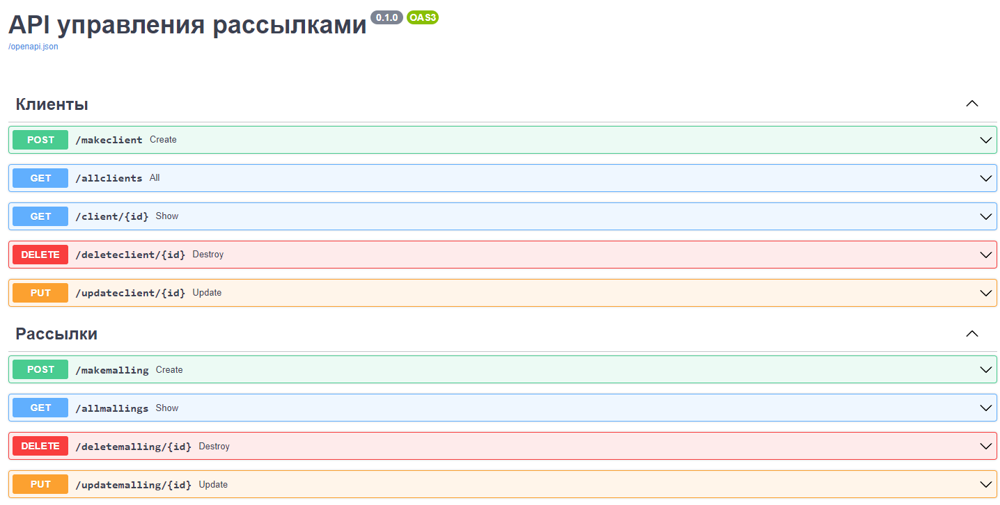

<h1 align="center">API Управления Рассылками<h1>

<h2 align="center">

</h2>

<h2 align="center">

API на FastAPI которое умеет создавать клиентов и редактировать для них рассылки

</h2>

<h2>
  
Стек:

- логика FastAPI
- база данных SQLite
- запросы к базе на SQLAlchemy 
- сервер UVICORN
- модели на PyDantic 
- автоматическая документация OpenAPI

</h2>
  

